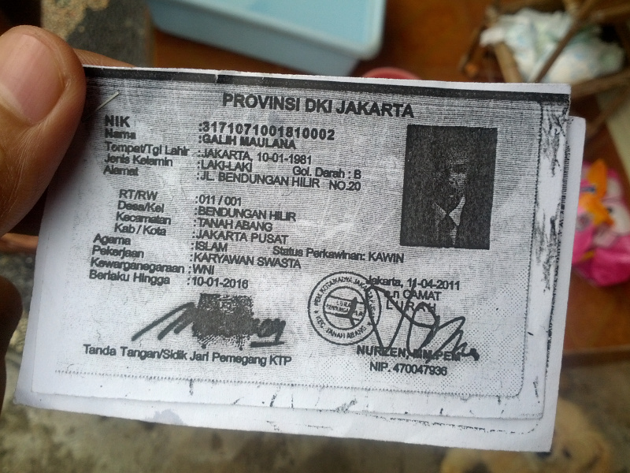
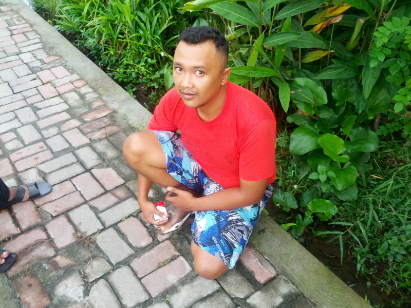
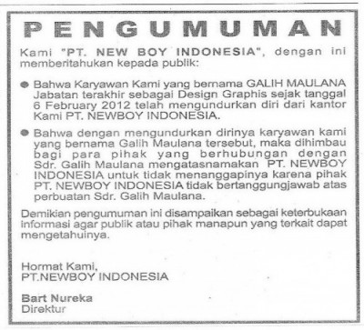

> **Disclaimer** Tulisan dibuat semata-mata sebagai catatan bahwa saya pernah menjadi korban penipuan, dan tentunya dengan harapan agar catatan ini berguna bagi siapapun di masa depan yang kemungkinan terjebak dalam situasi yang sama dengan saya saat tulisan ini dibuat.
> 
> Tulisan dibuat dengan kesadaran penuh bahwa saya adalah penduduk Negara Kesatuan Republik Indonesia yang punya hak dalam kebebasan berekspresi. Hal ini saya baca dalam buku berjudul [Kebebasan Berekspresi Panduan Bagi Jurnalis dan Aktifis Kebebasan Berekspresi (Asosiasi Jurnalis Independen / AJI, cetakan pertama Maret 2010)](http://leonardo.situmorang.net/wp-content/uploads/2013/01/Kebebasan_Berekspresi_Panduan_Bagi_Jurnalis_dan_Aktifis_Kebebasan_Berekspresi.pdf).
> 
> Tulisan tidak dibuat dengan tujuan untuk menyudutkan maupun menjelek-jelekkan (upaya pencemaran nama baik) pihak manapun.
> 
> Tulisan ini dapat diakses siapapun, dimanapun, kapanpun, dan bebas disebarluaskan tanpa terlebih dahulu meminta izin kepada saya. Tetapi saya tidak bertanggungjawab atas efek samping --dalam bentuk apapun-- yang tidak saya harapkan dari penyebaran catatan ini.
> 
> Saya juga tidak bertanggungjawab atas segala bentuk peristiwa yang mungkin terjadi di masa depan yang mungkin saja diakibatkan oleh catatan ini.
> 
> Apabila pembaca menemukan ada informasi yang tidak valid, dan bisa membuktikan hal tersebut, silahkan kontak saya melalui kolom komentar.
> 
> Pembaca yang tidak menyetujui isi disclaimer ini sangat tidak disarankan untuk melanjutkan membaca.
> 
> Pembaca yang menyetujui disclaimer ini sebaiknya membaca catatan secara utuh.

Catatan ini dibuat dengan susunan sebagai berikut:

1. **[kronologi](#kronologi "Kronologi")** mencatat awal pertemuan, laptop berpindah tangan, penangkapan, dan pembuatan laporan
2. **[penggalian informasi](#penggalian_informasi "Penggalian Informasi")** mencatat awal keraguanku yang berujung ke proses mencari informasi sebanyak mungkin tentang GM, mencari korban GM sebelumnya dan berkomunikasi dengan mereka
3. **[updates](#updates "Updates")** berisikan update dari korban GM lain yang menurutku penting untuk disimak

## Kronologi

Kronologi dibuat mengacu pada catatan waktu komunikasi via sms dan Facebook ke Galih Maulana (GM atau Ai atau Ai Galih). Detail dari informasi sebisa mungkin aku jaga dan siap untuk dipertanggungjawabkan. Beberapa informasi tambahan yang mungkin ada di dalam kronologi bersumber pada ingatan ketika berkomunikasi secara lisan dengan GM.

_Catatan: penggunaan nama sesuai dengan urutan waktu._

**November 16, 2012** Berkenalan dengan Ai di sebuah villa di Ubud. Berdasarkan pengakuannya; dia dari Jakarta dan awalnya sedang liburan di Bali, tapi karena merasa bisa survive disini dengan melakukan freelance maka dia memutuskan resign dari perusahaan yang bernama Hasbro PT. Newboy Indonesia (distributor tunggal [Hasbro](http://en.wikipedia.org/wiki/Hasbro "Hasbro") di Indonesia) yang berlokasi di Jakarta.

**Desember 11, 2012** Laptop ASUS-ku berpindah tangan ke Ai sekitar jam 1 siang. Memang niatku adalah menjual laptop tersebut seharga 4.5 jt rupiah. Karena aku menganggap Ai adalah teman, dan merasa bahwa dia masih lama menetap di villa tersebut, maka aku percaya saja ketika dia bilang akan transfer uangku melalui ATM.

**Desember 17, 2012** Ai kirim sms yang menanyakan nomor rekening BCA ku.

**Desember 21, 2012** Uang pembayaran laptop belum dikirim. Ini adalah kali pertama aku bertanya ke Ai melalui sms perihal uang pembayaran laptop.

Ai membalas. Katanya dompetnya hilang dua hari sebelumnya (Desember 19, 2012). KTP dan ATM-nya ikut hilang bersama isi dompet lainnya. Aku percaya saja.

**Desember 24, 2012** Bertemu langsung dengan Ai di villa. Aku sempat bertanya bagaimana status ATM sekaligus menanyakan kapan bisa membayar laptop. Ai bilang masih belum bisa bayar. Ini kali kedua aku menagih pembayaran.

Di kesempatan ini Ai juga mengajak ke Gili Trawangan untuk menghabiskan akhir tahun disana, bersama dengan teman-teman yang lain. Aku menolak.

Sebenarnya terasa janggal sekali karena Ai ini tidak merasa risih punya hutang dan bisa pergi liburan akhir tahun yang sudah pasti menghabiskan uang yang tidak sedikit.

**Januari 3, 2013** Kali ketiga aku menagih pembayaran. Jawabannya: "ntar kalau sudah di Ubud aku transfer".

**Januari 7, 2013** Kali keempat aku menagih pembayaran. Masih melalui sms. Tapi kali ini kesabaranku habis. Aku minta laptopku dikembalikan saja.

Tidak ada balasan.

Malamnya Ai membalas melalui Facebook. Aku tagih lagi. Dia masih tidak bisa bayar, alasannya: habis bayar tukang-tukang.

Kesabaranku sudah habis. Aku jelaskan bahwa aku mau laptopku kembali. Jawabnya: "janganlah, gw udah nyaman dengan laptop lo". Lalu dilanjutkan dengan mengulur waktu dan membuat janji baru untuk membayar hari Kamis (Januari 10, 2013).

Perlu aku tambahkan bahwa di November - Desember, Ai pernah bercerita bahwa dia sedang terlibat dalam kerjasama membuat cabang ke-3 sebuah usaha spa di Ubud. Aku pernah tanya, dia sudah habis berapa untuk pembangunan spa. Pengakuannya waktu itu: hampir 50 juta rupiah.

**Januari 10, 2013** Aku sengaja menahan diri untuk tidak menghubungi Ai. Masih menunggu niat baiknya. Tapi sampai jam sepuluh malam, belum ada kabar juga.

Akhirnya aku sms yang isinya menjelaskan bahwa tidak ada toleransi; aku ingin laptopku kembali, dan besok (Januari 11, 2013) aku akan menjemput laptop tersebut, oleh karena itu aku minta alamatnya.

Ai membalas sms, masih mencoba mengelak: "tadi ribet banget di spa, besok sambil jumatan gw ke bank."

Tapi saya kekeuh. Saya sudah beri waktu sebulan untuk dia membayar laptop tersebut. Tidak ada lagi kompromi.

Sampai beberapa sms, saya belum juga mendapatkan alamat. Malah, dia memberikan alasan lain: laptop sedang dipakai nge-render.

**Januari 11, 2013** Akhirnya dia memberi lokasi tempat dia tinggal yang berlokasi di Jalan Andong.

Ada beberapa sms yang isinya masih berusaha untuk mengulur waktu. Tapi sudah tidak mempan.

Jam 12 siang aku tiba di Jalan Andong (tepatnya: Jalan Raya Andong, Ubud). Aku sms dia, dan akhirnya kami bertemu di Dewata Supermarket tepat di seberang Polsek Ubud. Dilanjutkan dengan pergi ke kos Ai.

Di kos-nya, saya cek isi kamarnya cuma ada dua televisi: LCD yang cukup besar, dan LCD yang kecil tergantung di dinding. Aku tidak melihat laptopku. Tapi aku masih tetap diam, lalu beranjak ke teras.

Setelah menunggu sekitar 10 menit, baru dia katakan bahwa laptop tersebut ada di Singaraja sedang digunakan rekannya untuk proses rendering dari kamera analog kamera video ke komputer.

Aku katakan bahwa aku sudah tidak perduli. Aku beri waktu dua jam (toleransi waktu tempuh Singaraja - Ubud), agar laptop tersebut diantar ke Ubud. Ai kemudian menghubungi rekannya via telepon (aku tidak bisa dengar karena dia bertelepon di dalam kamar, sementara aku di teras).

Ternyata dia masih berusaha untuk mengulur. Proses rendering tersebut tidak bisa di-interupsi -- mengejar deadline, alasannya. Dia meminta agar diberi waktu sampai Minggu (Januari 13, 2013) sampai proses rendering selesai.

Aku sempat bilang kok bisa dia menggunakan laptop tersebut untuk keperluan bisnis, tapi tidak memikirkan pembayaran. Belum lagi sempat pergi berlibur, serta ditambah pindah ke tempat tinggal yang baru dengan harga sewa tiga setengah juta rupiah per-bulan.

Khusus untuk sewa kos yang mahal, dia sempat berkilah bahwa dia sudah bayar dimuka sejak Oktober. Dan aku percaya saja, karena memang bukan hal yang tidak mungkin mengingat akhir tahun adalah high-season, khususnya di Bali.

Aku masih teguh dengan pendapatku bahwa ini tidak bisa ditoleransi lagi. Sebagai jalan tengah, aku ajak dia ke kantor polisi untuk menulis dan menandatangani surat perjanjian bersama-sama dihadapan aparat kepolisian. Harapanku, apabila dia tidak bisa menepati isi surat perjanjian maka dia bisa berurusan dengan pihak kepolisian.

Sesampainya di kantor polisi, setelah aku jelaskan duduk perkaranya, bapak polisi menjelaskan bahwa mereka tidak bisa membantu banyak karena ini bukan kasus pidana.

Aku sempat bertanya: "apabila kami menulis surat perjanjian yang dibubuhi meterai dan disaksikan mereka (bapak-bapak polisi), dan Ai masih tidak bisa menepati janjinya, apakah mereka bisa bantu?"

Ternyata tidak. Kasus perdata urusan pengadilan, kata si pak polisi.

Aku patah arang. Kemudian memutuskan pulang. Tapi sebelum pulang, Ai masih menjanjikan bahwa hari minggu dia akan kembalikan laptopku. Aku jawab seadanya: terserah.

**Januari 13, 2013** Jam setengah empat sore aku tagih lagi janjinya Ai. Setengah jam kemudian dijawab: "tar malam gw kabarin lo".

Kutanya "ketemuan dimana?"

"Ketemuan dimananya ntar malam gw kabarin", balas si Ai.

Aku geram. Aku tanya ke dia dimana posisi laptopku, apakah masih di Singaraja atau sudah dia pegang.

Ternyata masih di Singaraja. Dan balasan sms ini kisaran jam empat menuju setengah lima sore.

Menurutku sudah ga masuk akal. Butuh minimal 5 jam pulang-pergi Denpasar > Singaraja. Mau jam berapa lagi ketemuannya?

Jam sembilan malam, kurang enam menit, Ai sms yang menyatakan kalau dia masih di Singaraja terjebak hujan gede.

Itu sms dia yang terakhir ... sebelum akhirnya tertangkap.

**Januari 14, 2013 - pagi menuju siang** Aku kirim sms beberapa kali. Beberapa panggilan telepon. Tidak ada balasan apapun.

Aku merasa tertipu dan akhirnya terpikir untuk mencari tahu siapa Ai ini sebenarnya. Pada titik ini, aku menyadari bahwa aku tidak tahu nama aslinya.

Hal pertama yang terpikir adalah profil Facebook milik Ai. Disinilah kejanggalan pertama yang kutemukan: jumlah friends-nya "cuma" 47.

Kenapa janggal? Untuk orang se-ramah/luwes/easy going seperti karakter Ai, hampir mustahil untuk punya teman yang, sekali lagi, "cuma" 47. Apalagi kebanyakan diantara 47 tersebut adalah orang-orang yang ada di lingkaranku di Ubud. Dari informasi ini, kecurigaanku meningkat.

Aku mulai coba buat asumsi bahwa akun Facebook tersebut adalah alat untuk membangun trust (kepercayaan).

Aku simpan banyak foto dari profil Facebook --yang aku asumsikan-- palsu tersebut. Harapanku adalah: kalaupun dia hilang, aku masih bisa mempublikasikan fotonya di Internet.

Karena masih belum mendapatkan nama aslinya, aku coba kontak kenalanku pengelola villa tempat Ai tinggal (dan tempat kami berkenalan) menanyakan apakah dia menyimpan salinan informasi (kartu identitas atau semacamnya) milik tamu yang tinggal di villa tersebut. Biasanya memang harus disimpan, sayangnya si pengelola tidak menyimpan informasi Ai. Tapi dia (pengelola) katakan, untuk coba menanyakan hal tersebut ke penjaga/pengurus villa.

Dari pengurus villa (katakanlah B), aku juga mendapatkan jawaban yang sama. Tapi ada sesuatu yang menarik: B bilang bahwa Ibu Kos dimana Ai menetap juga meminta salinan kartu identitas. B menambahkan, bahwa dia ditugaskan Ai untuk membersihkan kamar kos milik Ai beberapa kali seminggu. Ini yang menghubungkan Ibu Kos dengan B.

Aku bertanya kepada B, kenapa Ibu Kos juga meminta salinan kartu identitas. B tidak tahu. Ini pun menambah kecurigaanku.

**Januari 14, 2013 - siang menuju sore** Karena takut teman-temanku yang lain --yang belakangan juga menjadi teman Ai-- kena tipu, aku mulai kontak mereka.

Yang pertama ku kontak adalah K, melalui Whatsapp.

Ketika aku mulai menjelaskan untuk berhati-hati terhadap Ai, K malah bilang bahwa dari hari Sabtu sampai Minggu (Januari 12-13, 2013) si Ai menginap di tempatnya. Pernyataan K inilah yang menjawab kecurigaanku. Kesimpulannya: Ai memang sama sekali tidak punya niat baik.

Sekarang tinggal bagaimana mendapatkan Ai.

**Spa** Waktu itu aku coba mengingat-ingat informasi yang pernah diberitahu Ai, aku juga bolak-balik melihat foto dan gambar yang ada di timeline Facebook-nya.

Beberapa foto menggambarkan progres pembangunan. Hal ini mengingatkan satu informasi: kerjasama bisnis dengan spa untuk membangun cabang ke-3. Siang itu juga aku berangkat ke Ubud, menuju spa tersebut.

Di spa aku bertanya ke sejumlah staff-nya dan mendapatkan bahwa Ai sama sekali tidak memiliki kerjasama bisnis dengan pemilik spa, dan sama sekali tidak ada pembangunan cabang ke-3.

Disini aku mulai menyadari bahwa: Ai pintar sekali memanfaatkan Facebook untuk membangun alibi. Dia tahu persis bahwa kita disekitarnya tidak punya cukup waktu untuk memvalidasi memverifikasi informasi yang dia keluarkan.

Aku tinggalkan nomor handphone ke staff spa tersebut, lalu beranjak ke rumah kos Ai.

**Rumah Kos** Di rumah kos, aku menjelaskan kasusku ke Ibu Kos. Sialnya, si Ibu Kos juga kehilangan televisi LCD 22". Televisi yang hari Jumat (Januari 11, 2013) lalu masih ada di kamar Ai.

Dari Ibu Kos aku mendapatkan salinan kartu identitas Ai, salinan itu pun diberikan Ai dalam bentuk fotokopian. Ibu Kos tidak pernah punya akses ke KTP asli Ai. Aku ambil foto dari kopian kartu identitas tersebut. Sampai tulisan ini dibuat aku masih ragu dengan keaslian informasi di KTP tersebut.

Galih Maulana. Begitulah nama yang tertera di kopian KTP tersebut.

Sebelum aku pergi, Ibu Kos menambahkan bahwa GM juga belum membayar uang sewa kos -- hal ini jelas bertentangan dengan pernyataan GM pada minggu sebelumnya.

Aku tinggalkan nomor handphone kepada Ibu Kos. Selanjutnya aku ke kantor polisi.

Kali ini melaporkan penipuan.

**Kantor Polisi** Di kantor polisi aku bertemu dengan beberapa polisi yang sama ketika membawa Ai jumat sebelumnya. Aku menjelaskan kembali masalah penipuan ini.

Ditengah penjelasanku ke pak polisi, aku mendapat sms dari staff spa. Isinya memberitahu bahwa Ai sedang berada di spa tersebut. Sontak aku langsung bilang ke pak polisi bahwa orang yang aku laporkan sedang berada di spa. Aku langsung lari keluar ke pelataran kantor polisi. Dua orang polisi yang tidak berseragam menanyakan dimana lokasi spa tersebut dan kami langsung pergi meninggalkan kantor polisi menuju spa.

**Spa** Susah untuk menjelaskan bagaimana paniknya saat itu. Geram dan deg-deg-an. Seolah tak mau menyisakan ruang untuk Ai bisa kabur. Aku jalan kesana kemari memastikan tidak ada ruang tersebut.

Kami bertiga berjalan melalui jalan setapak pinggir sawah menuju spa. Dan kemudian mendapati Ai sedang ngobrol dengan pemilik spa.

Pertanyaan pertamaku waktu itu: "kenapa lo ga balas sms gw?" Ai menjawab dengan begitu tenang: "handphone gw yang satu lagi ketinggalan di kos"

Lima menit kemudian, ketika di-interogasi oleh pak polisi, aku coba misscall nomer Ai. Handphone tersebut berdering.

Sinting memang. Ai ini sungguh professional. Tenang sekali.

Galih Maulana ketika ditangkap dan diperintahkan pak polisi untuk duduk di tanah, tapi masih tetap _ngoyo_.

Pak Polisi memutuskan untuk menginterogasi Ai di salah satu ruang di dalam kompleks spa -- selagi menunggu mobil tahanan datang. Selama interogasi, keluar pernyataan dari mulut Ai bahwa laptopku sudah dijualnya di salah satu toko komputer di Rimo (Jalan Diponegoro, Denpasar) pada bulan Desember. Terbukti sudah bahwa dia menipuku. Aku lupa berapa tepatnya hasil penjualan laptopku, yang pasti hasil penjualan laptop tersebut dibuatnya untuk membeli Galaxy Tab. Dia juga mengaku telah mencuri dan menjual televisi milik Ibu Kos seharga 600 ribu rupiah. Sayangnya aku lupa dimana dia jual televisi tersebut.

Ketika pak polisi memeriksa barang-barang yang ada di tas kecil miliknya, kami temukan KTP. Ini sekali lagi membuktikan kebohongannya ketika mengatakan bahwa KTP dan ATM-nya hilang bersama dompet.

Informasi pada KTP yang kami temukan tersebut sesuai dengan informasi yang tertera di fotokopian yang aku dapatkan dari Ibu Kos.

Tak lama kemudian Ai dibawa ke kantor polisi. Aku dan kedua polisi tak berseragam tersebut menyusul.

_Catatan: aku sangat berterimakasih sekali kepada kedua bapak polisi tak berseragam tersebut. Salah satu diantaranya ternyata polisi senior, beliau menyuruhku menyimpan nama dan nomor teleponnya. Juga tak lupa untuk memberi kredit ke bapak polisi lainnya yang sudah menerima laporanku waktu itu._

**Kantor Polisi** Setibanya di kantor polisi aku langsung diminta untuk membuat laporan. Karena saat itu sudah sekitar jam tujuh malam, aku disarankan untuk datang kembali pagi keesokan harinya (Januari 15, 2013) -- untuk keperluan membuat laporan penipuan oleh Galih Maulana yang lebih detail.

Disaat yang bersamaan, Ibu Kos bersama anak laki-lakinya datang melapor juga. Total ada dua laporan yang dibuat malam itu, dengan GM sebagai terlapor.

**Januari 14, 2013 - malam** Karena aku sudah pegang nama lengkap yang untuk sementara waktu aku percayai sebagai nama asli Ai, malam itu juga aku coba melakukan pencarian di Google, berikut hasilnya (berdasarkan waktu kejadian):

- Mailing List Arakan Lebah (2007) [http://groups.yahoo.com/group/arakanlebah/message/2917](http://groups.yahoo.com/group/arakanlebah/message/2917)

- Fotografer.net (2011), Private Photo Hunt part 3: [http://www.fotografer.net/forum/forum.view.php?id=3194439060](http://www.fotografer.net/forum/forum.view.php?id=3194439060 "Fotografer.net Penipuan Galih Maulana")  
    Profile FN.net Galih Maulana: [http://www.fotografer.net/personal/index.php?id=102760](http://www.fotografer.net/personal/index.php?id=102760 "Profil Fotografer.net Galih Maulana") -- dari halaman profile ada foto GM dan link menuju blog-nya tahun 2006

- Kaskus (Juni 2012): [http://archive.kaskus.co.id/thread/4987475/260](http://archive.kaskus.co.id/thread/4987475/260)

- Kaskus (Juli 2012): [http://archive.kaskus.co.id/thread/15248321](http://archive.kaskus.co.id/thread/15248321)

Berdasarkan informasi yang aku dapatkan di atas --dengan asumsi bahwa Galih Maulana yang ada ditulisan ini adalah sama dengan Galih Maulana penipu Kaskus, bukan copy cat/impersonator-- ada beberapa hal yang kemudian jadi pertanyaanku:

- kemana GM selama periode 2007 sampai 2011?
- kok bisa GM melakukan aksinya dari 2007, sampai aku yang ada di 2012/2013 masih bisa kena? kok bisa ga kena jeratan hukum sama sekali?

Aku menyimpulkan bahwa GM ini mengembangkan kemampuannya menipu selama bertahun-tahun. Dia serius sekali menekuni penipuan.

_Catatan: satu-satunya petunjuk yang bisa digunakan untuk memastikan bahwa Galih Maulana yang ada dalam tulisan ini sama dengan Galih Maulana penipu di Kaskus adalah nomor rekening Bank Niaga yang digunakan untuk bertransaksi. Kalau ada yang bisa bantu membuktikan ini tolong beritahu saya ya._

**Januari 15, 2013 -- pagi** Pagi jam sembilan aku tiba di kantor polisi. Kali ini dimintai keterangan lebih detail terkait laporanku malam sebelumnya. Tak lupa, aku sempat membeberkan hasil pencarianku beserta kesimpulannya. Tapi rupanya pak polisi tidak bisa berbuat lebih jauh kalau hanya berdasarkan informasi yang didapat dari Internet. Harus ada laporan dan bukti, katanya.

Selama memberi keterangan aku dan pak polisi ngobrol banyak. Dia sempat bilang bahwa di dalam hp milik GM banyak terdapat SMS yang isinya senada denganku. _aku sempat berpikir, kenapa tidak diusut juga dari arah situ? digali lebih dalam._

Pertanyaan terakhirku sebelum pergi adalah: "kira-kira berapa lama GM akan mendekam di tahanan untuk kasusku?"

Pak polisi menjawab "bisa jadi hanya 4 bulan".

Hal yang sulit kuterima. Karena aku yakin waktu segitu sangat cepat dan tidak sebanding dengan kejahatan yang sudah dilakukan GM sebelumnya -- meski belum bisa kubuktikan. Masa tahanan tersebut tentu saja tidak menjamin apapun dalam menghindari jatuhnya korban lain di masa depan.

"begitulah hukum kita, mas leo. koruptor miliaran di tv saja diputuskan 4.5 tahun" kalimat penutup bapak penegak hukum.

**Januari 15, 2013 -- siang** Jam 15.18 aku menerima SMS dari GM yang bunyinya demikian: "Bro, ini masih bisa diselesaikan secara kekeluargaan. So, please lets talk. Ga usah sampai jadi begini".

Aku rasa pembaca sudah bisa menebak bagaimana SMS balasanku.

Tapi satu hal yang jadi pertanyaanku: bagaimana caranya seorang tahanan bisa punya akses ke handphone yang seharusnya jadi barang bukti atau minimal barang sitaan?

Seandainya aku jadi GM: aku hapus semua jejak di hape tersebut yang bisa membuka kemungkinan masalahku menjadi lebih besar.

Seandainya aku jadi pak polisi: aku tidak akan membiarkan terlapor menyentuh benda komunikasi dalam bentuk apapun, kecuali dalam kondisi pengawasan yang ketat dan hanya untuk keperluan menghubungi keluarga/kerabat.

Aku cuma bisa merinding disko ketika menerima dan membalas sms tersebut. _This is insane_.

_Catatan: belakangan aku baru tahu bahwa ketika seseorang masih dalam status 'dititipkan' (ditahan selama 1 x 24 jam di kantor polisi), orang tersebut berhak untuk mengakses alat komunikasinya untuk keperluan menghubungi pengacara, misalnya._

## Penggalian Informasi

Januari 14, 2013 malam aku sudah mulai melakukan pencarian melalui Google, dan hasil pencarian sudah aku buat di atas. Setelah dapat respon dari pak polisi yang agak membuat down, serta kesibukan lain yang tidak bisa ditinggalkan, aku baru bisa melanjutkan pencarian informasi kira-kira seminggu setelahnya.

Motivasi ku cuma satu: mencari sebanyak mungkin korban lain, khususnya mereka yang pernah melapor ke polisi. Semakin banyak laporan yang masuk ke polisi, harapanku semakin besar kemungkinan GM akan mendekam di tahanan selama mungkin.

**Handle** Dari profil Facebook milik GM, aku menemukan kata `shoeater`. Kata ini biasa disebut sebagai _handle_; pengenal yang kita gunakan ketika kita beraktifitas di Internet. Sederhananya _username_ atau nama pengguna.

Kebanyakan orang menggunakan satu handle pada banyak layanan Internet yang dia gunakan. Oleh karena itu aku menggunakan _handle_ `shoeater` (dan kombinasinya, misalnya: shoeaters) pada pencarian dengan Google.

Karena hasil pencarian dengan handle saja tidak memberi banyak hasil yang relevan, aku membubuhi kata 'galih'. Biasanya akun yang kita daftarkan pada sebuah layanan juga membutuhkan nama depan atau belakang.

Akhirnya aku dapat lumayan banyak hasil yang lebih relevan. Tapi ternyata yang menghubungkanku langsung ke salah satu korban GM sebelumnya adalah melalui blog GM di layanan Multiply: [trancesystem](http://trancesystem.multiply.com/).

Dari blog tersebut aku mendapatkan beberapa nama yang berkomunikasi dengan GM melalui kotak komentar. Nama yang kudapatkan tersebut kemudian aku gunakan untuk pencarian berikutnya sampai akhirnya kami bisa berkomunikasi. Dari satu orang, kemudian terhubung ke orang-orang lain yang juga korban GM.

**Arakan Lebah** Dari milis Arakan Lebah (Alumni Desain Komunikasi Visual), aku sempat kirim email ke salah satu anggota milis tersebut tapi tidak ada balasan. Kemudian aku coba cari nama korban GM di milis tersebut menggunakan Facebook, dan ternyata ketemu. Mas Banus, melalui Facebook Chat, mengatakan bahwa dia sudah mengikhlaskan karena ternyata sudah banyak korban lain yang mencoba me-'meja hijau'-kan kasus penipuan oleh GM, tapi ternyata GM selalu lolos.

**Hasbro (Newboy Indonesia)** Ketika mencari dengan Google, aku teringat lagi pernyataan GM ketika pertama kenal: dia baru resign dari Hasbro Indonesia (PT. Newboy Indonesia). Hal ini memberi ide untuk mencari orang yang bekerja di Newboy Indonesia, untuk konfirmasi apakah benar GM pernah bekerja disana.

Satu-satunya alat bantu yang tepat untuk ini adalah Linkedin, sebuah _social networking site_ untuk professional.

Aku coba _connect_ (_add as friend_) seorang ex-manager perusahaan tersebut lalu mengirimkan pesan yang menanyakan apakah benar GM pernah bekerja disana serta menyatakan bahwa aku adalah korban GM. Respon dari ex-manager tersebut menyatakan bahwa GM benar pernah bekerja di Newboy Indonesia -- malah dia juga mengakibatkan perusahaan tersebut rugi ratusan juta karena aksinya.

Belakangan aku dikontak oleh petinggi Newboy Indonesia yang memberi konfirmasi bahwa GM memalsukan tandatangannya untuk keperluan pembuatan _Purchase Order_ (PO). Hal ini terjadi tiga kali: dua kali sebelum penangkapan GM, dan sekali lagi terjadi ketika GM harus dilepas -- karena polisi membutuhkan waktu untuk membuktikan pemalsuan tanda tangan tersebut.

Senin (Januari 25, 2013) lalu, Pak Bart Nureka (Newboy Indonesia) mengirimkan salinan pengumuman yang mereka muat di harian Suara Pembaruan pada April 27, 2012 lalu. Pengumuman ini menekankan bahwa Galih Maulana tidak lagi memiliki hubungan kerja dengan PT. Newboy Indonesia.

> Dear Pak Leonardo
> 
> Terlampir scan iklan koran yang kami buat di Suara Pembaruan yang mengumumkan bahwa (Galih Maulana) GM tidak lagi bekerja di Perusahaan kami. Adapun maksud dan tujuan kami membuat pengumuman ini adalah agar apabila terjadi sesuatu yang mengatas namakan perusahaan kami yang dibuat oleh GM adalah bukan menjadi tanggung jawab kami karena alasan pengunduran diri GM dari perusahaan kami adalah karena yang bersangkutan melakukan PEMALSUAN TANDA TANGAN DAN DOKUMENT PERUSAHAAN. Atas kasus ini kami sudah melaporkan ke Polsek Kebayoran Lama tetapi pada saat dilakukan proses pengaduan (BAP) yang bersangkutan melarikan diri (Buron). Dan sebagai akibat dari pemalsuan ini maka telah tejadi korban penipuan dan penggelapan yang oleh si korban penipuan ini juga sudah dilaporkan ke Polsek Mampang. Jadi saat ini GM merupakan DPO untuk kedua Polsek di Jakarta (Polsek Mampang dan Kebayoran Lama)
> 
> Terima kasih atas perhatiannya dan semoga informasi ini bisa bermanfaat dan tidak ada lagi korban-korban penipuan lainnya yang dilakukan oleh GM ini.

## Updates

**Januari 25, 2013**

- Agnni, korban GM, memberi komentar dan masukan: [http://leonardo.situmorang.net/2013/01/25/gm/#comment-303](http://leonardo.situmorang.net/2013/01/25/gm/#comment-303 "komentar Agnni")

- Rio, korban GM, memberi komentar dan masukan: [http://leonardo.situmorang.net/2013/01/25/gm/#comment-305](http://leonardo.situmorang.net/2013/01/25/gm/#comment-305)

- Andy, korban GM, memberi komentar dan masukan: [http://leonardo.situmorang.net/2013/01/25/gm/#comment-307](http://leonardo.situmorang.net/2013/01/25/gm/#comment-307)

**Januari 26, 2013**

- Andy, korban GM, mengirimkan berkas [screenshots, kronologi, serta laporan yang dia kirim ke Bank BCA untuk memblokir rekening yang digunakan Galih Maulana ketika bertransaksi](http://leonardo.situmorang.net/wp-content/uploads/2013/01/andy_screenshots_kronologi_blokir_bca.zip).

**Januari 30, 2013**

- Andi, korban GM, mengirimkan berkas [screenshots penipuan Galih Malunana di Facebook](http://leonardo.situmorang.net/wp-content/uploads/2013/01/andy_screeshots_facebook.zip).
