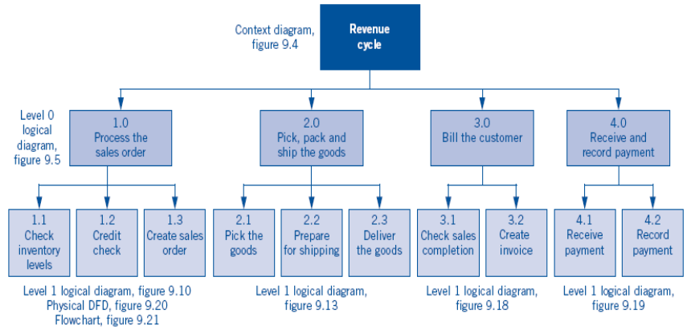

Week #5, 12 Oktober 2014

## The Revenue Cycle

> Tujuan: bisa membuat struktur serta desain DFD dan system flowchart dari revenue cycle (revenue), expenditure cycle (expenditure), production cycle (production), HRD cycle, dan general ledger (jurnal umum) dan laporan finansial menggunakan model REA.

Materi:

1. pembahasan Revenue Cycle serta tujuan utamanya ngapain aja sih
2. REA Revenue Cycle
3. DFD Revenue Cycle
4. System Flowchart of Revenue Cycle

Pertama, apa itu Revenue Cycle? Baca lagi catatan "Business Process Model" (minggu ke-2).

Berdasarkan transaksi yang berdampak pada aset dan modal perusahaan, Brett menyatakan ada tiga macam siklus:

- Expenditure cycle (pengeluaran)
- Conversion cycle (konversi/produksi)
- Revenue cycle (penjualan/pembayaran)

Nah, minggu ini secara spesifik fokus pada Revenue Cycle. Kita akan memodelkan siklus pendapatan.

> Siklus pendapatan dimulai ketika pelanggan menunjukkan keinginan untuk membeli suatu barang atau jasa dan berakhir ketika pembayaran diterima.

Selama proses, penjualan harus diotorisasi dan direkam dengan benar, barang harus dikemas dan dikirim kepada pelanggan secara tepat waktu dan benar.

Penagihan kepada pelanggan harus dilakukan dengan jumlah tagihan yang tepat, dalam waktu yang tepat, dan sesuai dengan barang dan/atau jasa yang diterima pelanggan.

Kegiatan diakhiri dengan penerimaan pembayaran dari pelanggan, yang tentunya harus cepat dan akurat pula.

Jadi siklus pendapatan terdiri dari proses bisnis penjualan dan proses bisnis pembayaran tagihan.

Secara keseluruhan proses ini terdiri dari event-event operasional yang berkaitan dengan:

- bagaimana menarik pelanggan
- membantu pelanggan memilih barang dan jasa
- menyerahkan atau mengirim barang dan jasa yang dibeli pelanggan
- menerima pembayaran dari pelanggan

Proses harus dilakukan dengan:

- meminimalkan waktu layanan mulai dari pemilihan produk dan jasa sampai dengan pembayaran
- meminimalkan jumlah uang tunai yang tidak tertagih, atau
- memastikan pembayaran untuk barang dan jasa dengan benar diterima, dan
- menetapkan harga yang seimbang dengan kualitas barang dan jasa dan seimbang antara kepentingan pelanggan dan keuntungan perusahaan

Proses penjualan merupakan proses melayani pelanggan dan terjadinya transaksi penjualan, sehingga proses ini harus dilakukan secara efektif dalam melakukan, merekam dan memantau penjualan barang dan jasa, serta mengatur pasokan cepat barang dan jasa.

### REA Siklus Pendapatan (Revenue Cycle REA)

_REA is all about operational events_ (lihat lagi catatan di minggu ke-2 Business Process Model). Dalam penyusunan REA, terlebih dahulu perlu dilakukan identifikasi event operasional.

Mengacu pada konsep dokumentasi dari siklus pendapatan yang yang digambarkan oleh Brett et.al. (2010, page 400), yang terlihat pada gambar di bawah, dapat diturunkan bahwa event operasional dari siklus pendapatan adalah:

- menerima pesanan (receive sales order)
- memilih
- mengemas dan mengirim barang (pick, pack, and ship the goods)
- menagih (bill the customer), dan
- menerima pembayaran (receive payment)

> Pada bahasan ini, payment record termasuk kategori event proses informasi, sehingga tidak digambarkan dalam REA.

 

Resources yang terkait adalah

- goods or services (inventory)
- cash

Agents yang terlibat adalah

- customers
- sales personnel
- courier
- warehouse personnel (gudang)
- treasury personnel (bendahara)

Gambar 02 berikut ini adalah REA model Siklus Pendapatan.

Pada diagram REA diatas, terdapat dua pasang entitas yang mempunyai kardinalitas M:M, sehingga untuk penyusunan database diperlukan entitas link order-good dan, entitas link ship-good.

Gambar 03 berikut adalah Revisi REA Model Siklus Pendapatan.

_Yeah, at some point I event make notes in this blog. My workflow usually was: translating text I read from referenced book, and re-read my translations several times until I fully grasped the idea (I am not a genius). This note is one of those translations written in October 12nd, 2014. Many of my notes is just a plain text files backed up in Dropbox._
