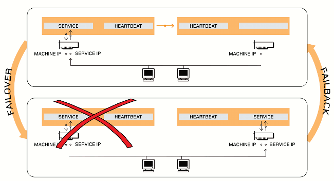

Selama ini gw pikir High Availability (HA) semata-mata hanya mempersiapkan cadangan kalau bencana (_disaster_) muncul. Mempersiapkan cadangan dalam artian _data backup_. Ternyata pemahaman tersebut tidak sepenuhnya benar. Hal ini baru gw sadari setelah diberikan pekerjaan untuk membuat solusi kalau sampai layanan telekomunikasi yang digunakan tim Customer Service (CS) kena bencana.

Hasil akhir yang diharapkan -- ingat selalu untuk berpikir dari _hasil akhir yang diharapkan_ \-- adalah: tim CS harus selalu dapat menggunakan layanan telekomunikasi. Mereka tidak peduli dan tidak perlu tahu\* kalau ada bencana terjadi. Yang mereka pedulikan adalah mereka datang ke kantor dan melakukan pekerjaan mereka: menghubungi dan dihubungi pelanggan.

Untuk itu harus ada minimal 2 (dua) layanan telekomunikasi yang berfungsi dalam waktu bersamaan. Namun hanya ada 1 (satu) layanan yang aktif digunakan dalam satu waktu\*. Katakanlah ada layanan utama dan layanan cadangan.

Ketika bencana terjadi (pasti terjadi, hanya masalah waktu) dan mengakibatkan layanan utama gagal beroperasi, maka saatnya layanan cadangan yang aktif. Istilah yang digunakan untuk mewakili proses ini adalah **_failover_**.

Ketika bencana berakhir dan layanan utama kembali normal. Maka layanan utama harus kembali aktif, menggantikan layanan cadangan. Proses mengembalikan penggunaan dari layanan cadangan ke layanan utama disebut **_fallback_**.

Hubungan _failover_ dan _fallback_ bisa dilihat pada gambar berikut ini. Gambar ini gw dapat dari dokumentasi "_Building Elastix-2.4 High Availability Clusters with DRBD and Heartbeat (using a single NIC)_". Sumber: http://www.theserverexpert.com/elastix\_2.4\_ha\_cluster-updated.pdf

Beberapa pertanyaan yang harus dijawab adalah:

1. layanan-layanan apa saja yang vital dan harus selalu tersedia?
2. apakah layanan-layanan tersebut dapat dibuat duplikasinya? hal ini harus menjawab pertanyaan lain, yaitu:
    - apa saja kebutuhan layanan-layanan tersebut?
    - bagaimana membuat duplikasi kebutuhan-kebutuhan tersebut?
    - seberapa mudah membuat duplikasi layanan tersebut?
3. data apa saja yang harus tersedia?

Sejauh ini baru itu saja yang terpikirkan. Seharusnya ada beberapa lagi, tapi gw belum sampai di sana.

Pertanyaan tadi keluar dari pengalaman ketika berusaha membuat duplikasi layanan telekomunikasi berbasis Asterisk. Asterisk dikelola dengan FreePBX, dan diberi nilai tambah oleh produk bernama Elastix. Elastix merupakan sekumpulan alat bantu yang dikembangkan di atas sistem operasi CentOS.

Asterisk memiliki modul bernama CDR (_Call Detail Recording_) yang berfungsi untuk menyimpan _metadata_ komunikasi telepon yang dilakukan melalui sistem.  Terdapat juga modul lain yang merekam semua pembicaraan. Oleh karena itu, data tadi harus selalu tersedia.

Elastix menggunakan SQLite sebagai penyimpanan data konfigurasi. FreePBX sebagai antarmuka Asterisk sepertinya tidak membutuhkan penyimpanan data apapun, namun memiliki beberapa modul tambahan yang mungkin saja membutuhkan penyimpanan data untuk menyimpan konfigurasi\*.

Yang ingin gw sampaikan adalah _pentingnya identifikasi detail kebutuhan tiap layanan karena menentukan apa yang harus diduplikasi dan caranya_.

**Apa yang dimaksud dengan _kebutuhan tiap layanan_?**

Di atas sudah gw jelaskan bahwa modul Asterisk bernama CDR membutuhkan MySQL untuk penyimpanan data. Hal ini memaksa untuk mencari tahu apakah MySQL memiliki fitur untuk melakukan duplikasi layanan. Setelah dicari tahu ternyata MySQL memiliki fitur replikasi. Lalu muncul pertanyaan selanjutnya, MySQL versi berapa yang digunakan? Apakah versi tersebut sudah mendukung skenario replikasi yang kita butuhkan? Intinya adalah pemahaman tools yang digunakan, layanan yang ditawarkan tool tersebut, serta kompleksitasnya.

**Kesimpulan**

High Availability (HA) sulit dan kompleks sekali. Karena harus dipikirkan secara matang dan dilakukan oleh mereka yang paham dan kenal betul karakteristik penggunaan layanan, karakteristik layanan itu sendiri, karakteristik kebutuhan layanan, dan sebagainya.

Tulisan ini gw buat semata-mata untuk mengeluarkan isi pikiran saja. Mungkin saja berguna buat orang lain.
