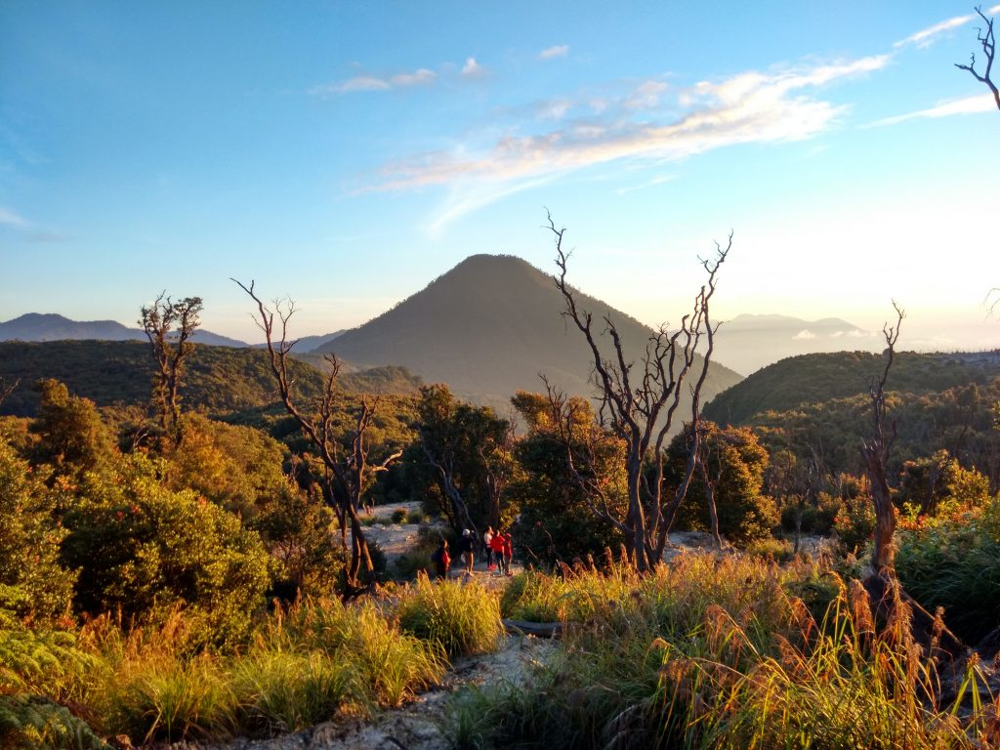
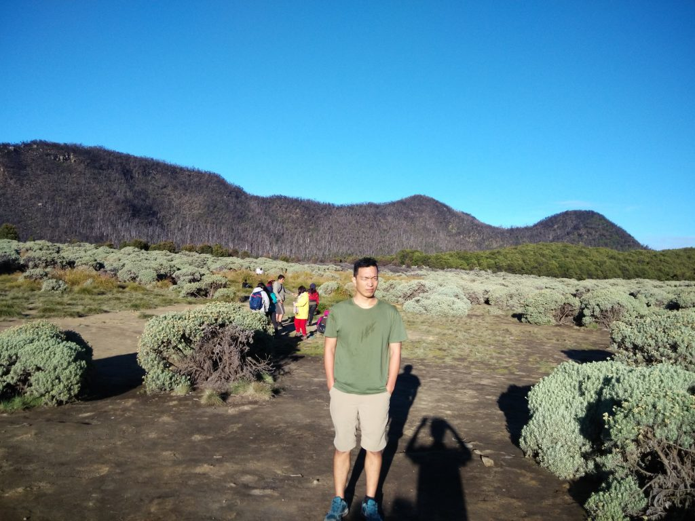

Saya, teman kantor, dan temannya teman kantor camping di Gunung Papandayan pada akhir Juli 2016 lalu.

Sudah sangat banyak artikel di Internet mengenai perjalanan di Gunung Papandayan. Jadi sepertinya saya tidak perlu mengulang-ulang hal yang sama. Satu hal yang perlu digarisbawahi adalah: **_suhu di gunung ini teramat sangat dingin_**.

Sayangnya kami tidak membawa _thermometer_ jadi tidak ada bukti untuk menunjukkan seberapa dinginnya malam itu. Untuk memberikan gambaran kira-kira seperti ini:

- saya rajin berolahraga dan secara khusus mempersiapkan diri untuk naik gunung
- malam itu saya pakai kaos yang lumayan tebal sebanyak 4 lapis dan dilapisi jaket di bagian terluar
- saya tidur di dalam sleeping bag yang lumayan tebal dan menutup seluruh tubuh
- kami tidur di dalam tenda, bertiga

Kalau ditotal mungkin saya cuma berhasil tidur selama 2 jam. Sisanya serasa bukan tidur karena tidak terlelap. Yang dirasakan hanya dingin dan tangan terasa kaku di dalam _sleeping bag_.

Oh, seperti yang lain, kami berkemah di Pondok Seladah.

Kira-kira jam 5 pagi sudah mulai terdengar keramaian oleh mereka yang ingin menuju Tegal Alun. Sejujurnya saya ingin istirahat dan tidur saja karena merasa kurang tidur dan tidak cukup yakin bisa sampai puncak. Tapi karena semua teman-teman sepakat untuk pergi maka saya pun memutuskan untuk ikut.

Singkat cerita saya sampai di puncak lebih dulu. Meninggalkan teman-teman yang lain. Mungkin karena langkah kaki saya yang lebih panjang. Ternyata waktu tempuh dari Pondok Seladah ke puncak (Tegal Alun) tidak terlalu lama; kira-kira 30 sampai 45 menit. Cukup melelahkan dan membuat putus asa tapi sepertinya hampir semua perjalanan menuju puncak seperti itu. Intinya tetap melangkah saja walau perlahan sekalipun.

Tegal Alun bisa dikatakan puncak Gunung Papandayan walau nyatanya ada bukit lagi di atasnya.

Demikian pengalaman naik ke Gunung Papandayan. Gunung ke-2 yang pernah saya daki dan pengalaman camping di alam bebas pertama.

Berikutnya: Gunung Prau.
