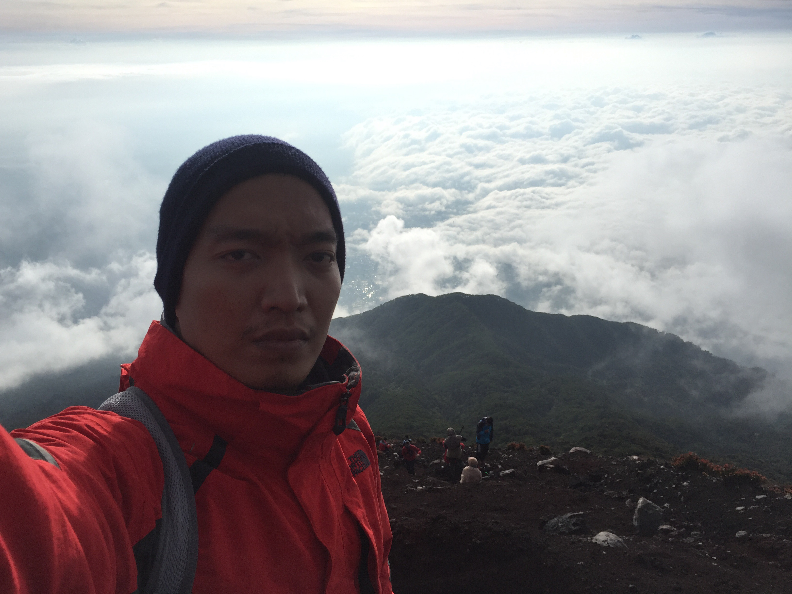

Maret atau April tahun 2016 lalu aku dan tim ku sekantor bepergian ke Lombok dan sempat menghabiskan satu hari di Gili Trawangan.

Setelah kembali Jakarta dan mendekati libur lebaran aku kepikiran untuk kembali ke Gili Trawangan. Karena penasaran ingin bermalam disana, coba diving, dan sebagainya yang tidak sempat dicoba sebelumnya.

Ketika browsing mencari informasi penginapan, entah bagaimana tiba-tiba aku  terdampar di sebuah blog perempuan asing berumur 40-an yang berisikan catatan perjalanannya mendaki Gunung Agung di Bali.

Aku bahkan sudah tidak ingat alamat situs perempuan tersebut. Yang kuingat adalah pendakian tersebut merupakan pendakian pertamanya dan beberapa karakter perempuan tersebut merupakan karakterku juga (ketika itu); mengatakan tidak pada banyak hal dan kebanyakan rasa takut.

Singkatnya, pendakian dia sukses. Oh, dia mendaki berdua dengan teman perempuannya dan ditemani guide -- yang kata si perempuan tersebut berjalan sangat cepat dan cenderung meninggalkan mereka sepanjang pendakian.

Aku ingat betul reaksiku setelah membaca catatan perjalanan tersebut: kalau perempuan tersebut saja bisa maka aku pun bisa.

Seketika itu juga aku lupa semua motivasi ingin liburan ke Gilis.

Jadi, pada Mei 2016 lalu aku melakukan pendakian pertama kali dalam hidup di Gunung Agung, Bali. Meskipun tidak mencapai puncak utama tapi merupakan pengalaman yang tidak bisa dilupakan.

Sekarang, April 2017, total sudah 6 gunung yang pernah ku daki:

- Gunung Agung, Bali
- Gunung Papandayan, Garut
- Gunung Prau, Dataran Tinggi Dieng
- Gunung Merbabu, Boyolali, Solo
- Gunung Slamet, Tegal - Purwokerto, dan
- Gunung Pusuk Buhit di Samosir, Sumatera Utara

Dan akhir pekan lalu, April 21-23 2017, aku baru saja mendaki Gunung Slamet untuk kedua kalinya.

Jadi dalam setahun terakhir aku berubah dari orang yang tidak pernah kepikiran untuk naik gunung menjadi pecandu berat. Tujuh kali naik gunung dalam satu tahun. Dan gunung yang paling berat, sejauh ini, didaki dua kali. Haha.

Ada beberapa gunung lagi yang akan aku daki sebelum pensiun: Rinjani, Kerinci, dan Annapurna basecamp. Setelah itu mungkin cari kecanduan baru lagi.

