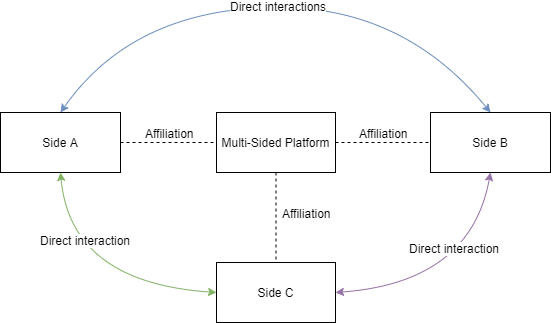
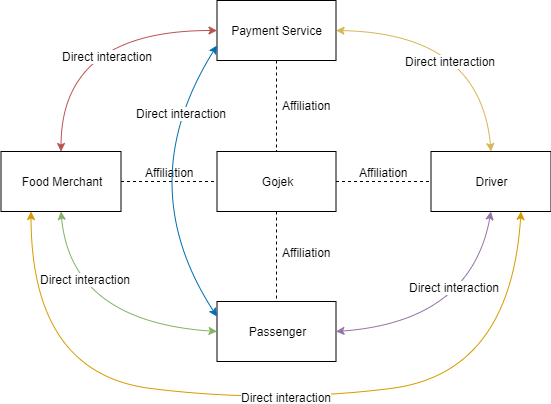
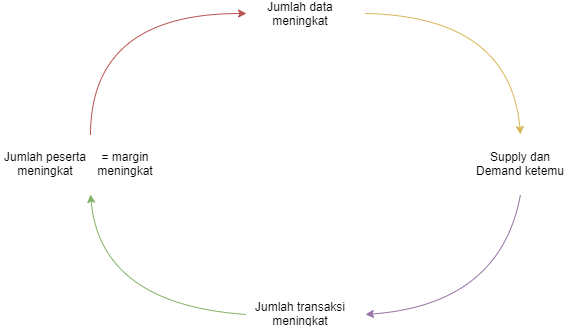
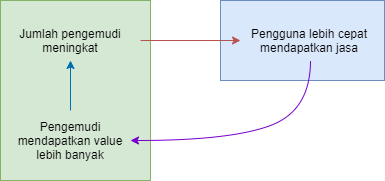

Source: [Strategic Decisions for Becoming a Multi-Sided Platform: A Case Study](https://aaltodoc.aalto.fi/bitstream/handle/123456789/29026/master_Korjus_Christine_2017.pdf) (Cia-Christine Korjus).

Multi-sided Platform has following traits:

- enabler of direct interactions between two or more distinct sides
- each sides affiliated with the platform

Affiliation: users on each side make platform specific investments that are necessary in order for them to be able to directly interact with each other.

Multi-sided platform lure at least two customer groups which differ from each other and enable cooperation between those groups.

For example:

- Passenger affiliates with Gojek in terms of Payment Service (e.g. Gopay, Ovo, etc). They put their money in it. Also trust. These are investments, and investments are considered as affiliation
- Food Merchant manages their restaurant menus in Gojek application. They need to keep it maintained and updated. They also register and keep in touch with merchandizer team from Gojek. They receives and handle orders dispatched from Gojek
- Payment Provider provides integration points or interfaces for Gojek, Driver, Food Merchant, and Passenger
- Driver register, update their credit amount, and ensure Passenger or goods (e.g. food) arrived at their destination

Multi-sided platform has 3 features:

- serves two or more different customer groups
- connection between different kind of customer groups creates direct and indirect network effects
- third party is needed to forward effects between different parties

## Network Effects

A situation where the benefit a person gets from usage of some platform correlates with the number of other users that use the platform.

Network Effects bisa positif, juga bisa negatif.

Network Effects positif artinya setiap pengguna baru di platform meningkatkan value of the platform sekaligus meningkatkan benefit yang didapatkan pengguna terdahulu.

Ketika ukuran jaringan membesar maka semakin besar atau banyak terjadi pertemuan atau transaksi antara supply dengan demand.

Semakin banyak jumlah transaksi yang terjadi dari poin sebelumnya, maka semakin banyak juga data yang digenerate; data ini digunakan untuk meningkatkan layanan untuk menghasilkan lebih banyak lagi transaksi.

Meningkatnya jumlah transaksi akan mengundang perhatian partisipan yang akan menghasilkan lebih banyak value. Pada akhirnya margin meningkat.

Network Effects menghasilkan feedback loop.

Siapapun yang berhasil mencapai volume transaksi tertinggi akan memberikan rata-rata nilai transaksi yang lebih tinggi juga.

Contoh: semakin banyak pengguna WhatsApp maka semakin bagus produknya karena semakin sering digunakan. Maka semakin sulit bubar (shutdown) karena tiap pengguna dan aktivitasnya menambah atau menghasilkan nilai (generates value).

Hubungan antar grup konsumen yang berbeda akan menghasilkan direct / indirect network effects.

Positive direct network effects terjadi ketika pengguna menghargai lebih tinggi sebuah produk ketika pengguna lain yang mirip menggunakan produk tersebut juga.

Negative direct network effects terjadi ketika pengguna kurang menghargai sebuah produk justru karena pengguna lain menggunakan produk tersebut juga. Hal ini terjadi misalnya konsumer ingin tampil beda (e.g. hipster).

Indirect Network Effects, dikenal juga dengan Cross-side Network Effects, berarti nilai pengguna di satu grup konsumen sebuah platform meningkat ketika jumlah partisipasi pengguna di sisi lain meningkat. Contohnya adalah pengemudi Uber atau Gojek akan mendapatkan nilai/uang/value lebih ketika ada lebih banyak pengguna. Demikian juga pengguna lebih cepat mendapatkan mobil ketika jumlah pengemudi meningkat.

Indirect Network Effects (Cross-side Network Effects) yang terjadi antara dua Consumer Group.

Indirect Network Effects adalah penentu keberhasilan sebuah Multi-sided Platform karena dapat menciptakan hambatan masuk yang tinggi (high entry barriers) terhadap kompetitor. Hal ini yang membuat Uber, Gojek, grab, dsb, sudah sangat sulit dikalahkan.

Namun di sisi lain membangun hambatan tersebut sangat sulit karena merupakan problem klasik: ayam atau telur. Butuh pihak lain untuk hadir agar pihak satunya juga mau masuk.

Perlu dicatat bahwa Indirect Network Effects bukan segalanya dan tidak menjamin hambatan masuk tinggi.

Multi-sided Platform juga perlu memiliki high switching cost (biaya pindahan yang tinggi). Karena rendahnya biaya pindah atau berganti platform serta mudahnya berpartisipasi di lebih dari satu platform akan membuat banyak kompetitor bermunculan.

## Level of Openness

Eisenmann argues: "it is crucial for firms who create platform to select the optimal level of openness".

Sebuah platform dikatakan atraktif untuk diadopsi jika:

- berhasil memanfaatkan atau mengendalikan atau memaksimalkan network effects
- mengurangi kekhawatiran pengguna terhadap vendor lock-in
- merangsang pengembangan produk komplementer

Definisi "openess": sebuah platform dikatakan terbuka terhadap partisipan jika

- tidak ada restriksi atau batasan atau larangan terhadap pengembangan produk komplementer
- tidak ada restriksi terhadap usaha komersialisasi
- restriksi, jika ada, seharusnya reasonable dan tidak memilih-milih (non-discriminatory)

Open architecture allows different players of the platform to access platforms resources and create new sources of value.

Open governance allows participants (other than owners) to shape the rules of the trade and reward sharing on the platform.

## Platform Governance

Harus bijaksana seberapa terbuka platform tersebut.

Open = terbuka = masuk ke dalam struktur sebuah platform dan didukung untuk berparttisipasi atau berkontribusi.

Facebook lumayan "relax" atau bisa disebut "sangat terbuka" perihal akses terhadap data pengguna. Namun seiring waktu terdapat perubahan peraturan.

Yang dilakukan Facebook adalah governance yang efektif yang menginspirasi dan mendukung inovasi serta mengundang partisipan untuk membawa intelectual property mereka ke platform.

Partisipan sebuah platform, yang merupakan outsider, tidak akan mau kontribusi/investasi/berafiliasi jika pemilik platform menghindari eksploitasi atau sangat restriktif (Von Alstyne, 2016).

Platform governance punya dua tujuan yang saling bertentangan (conflicting goals):

- to maintain controls
- to transfer design capability to 3rd party developers

### Control

Control (kendali) dibutuhkan untuk memastikan:

- business value terbentuk
- keamanan terjamin
- integritas terjaga
- pengelolaan yang tepat terhadap platform

Di paper dikatakan bahwa terkadang platform perlu untuk memindahkan pekerjaan perancangan (design capability) ke users. Tapi tidak dijelaskan kenapa. _Mungkin_ belajar dari Twitter yang terus evolved seiring waktu berdasarkan penggunaan (atau feedback dari) pengguna?

Anyway, untuk bisa melakukan keduanya, platform owner membuat "boundary resources" yang mendukung / memungkinkan application development. Boundary resources ada dijelaskan di paper, tapi tidak saya buat catatannya waktu itu.

### Third-Party Development

Third party developers diharapkan kontribusi di inovasi terhadap platform. Platforms owners fokus di penyediaan resources yang akan mendukung pengembangan apps 3rd party.

#### Open Innovations

Keterbukaan (openess) yang mengharapkan inovasi dari pihak luar menghadirkan tantangan (challenges) karena inovasi tentu dihasilkan juga dari dalam.

Challenges while integrating internal & external innovations:

- maximizations
- incorporations
- motivation

Maximizations: wide ranges of approaches are needed to maximize the returns of internal innovations.

Incorporations: organization cannot identify relevant knowledge and how exactly to incorporate it into its innovation processes -- while external knowledge provides no benefits.

Motivation paradox: "why would company contribute intellectual property that is gonna be available to their rivals?"

Note on Open Innovations: "it is economically beneficial under 'competition' condition that firms in the same industry complement each other in creating markets -- but compete in another".

Disebutkan di paper bahwa "intellectual property" yang dapat di-observasi rivals disebut "spillovers".

Spillovers: innovations yang dibuat tersedia / terbuka baik oleh 3rd party developers maupun kompetitor platform.

Organisasi harus mampu identifikasi inovasi yang relevan serta memiliki kapasitas untuk menyerap / mengadopsi invovasi tersebut serta memahami sekaligus lebih jauh mengkombinasikan inovasi tersebut untuk keperluan / kepentingan internal sesuai kebutuhan.

Inovasi dapat diterima jika organisasi diuntungkan misalnya market share bertumbuh.

* * *

Beberapa catatan tambahan:

Identify possible external forces that may add or extract value in an ecosystem. (Van Alstyre, 2016)

Pertanyaannya adalah kapan kita bisa mulai identifikasi external factos ini? Contohnya? Konteksnya?

Selalu identifikasi 3 hal ini:

- pertanyaannya apa
- konteksnya apa
- contohnya apa

Tidak berkaitan dengan poin sebelumnya tapi kesimpulan yang bisa gw ambil adalah sebuah platform dikatakan berhasil kalau third party dapat membangun komplementor yang berhasil juga.

Penjelasan mengenai Openess dan Platform Governance di atas adalah usaha untuk mendukung pertanyaan ini.

Perlu identifikasi key complements serta adanya insentif untuk memupuk third party untuk membuat inovasi komplementer.

* * *

Penutup. Catatan ini kubuat di 2019 ketika sangat penasaran apa yang membuat sebuah platform berhasil. Paper di atas sangat membantu dan informatif dalam menjelaskan banyak hal seputar hal ini. Perlu digarisbawahi bahwa catatan di atas dibatasi pemahamanku yang sangat mungkin salah.
