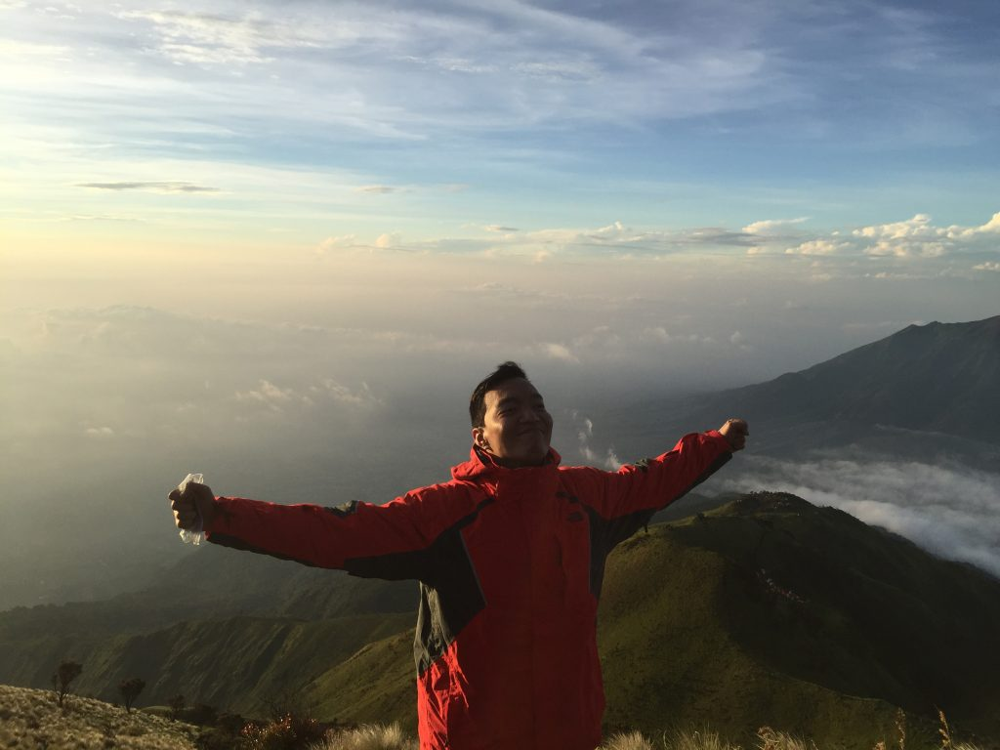

Gw baru hiking di umur 30. Dan pertama kali hiking langsung ke Gunung Agung di Bali. Kapan-kapan kuceritakan detailnya but it still feels like it was yesterday.

Lalu, apakah naik gunung pertama kali lantas membuat happy? Oh tentu tidak. Malah kebalikannya; frustrasi berat karena tidak menyangka akan sesulit itu (walau rada bangga akhirnya bisa mengalahkan diri sendiri).

Menurutku kebahagiaan naik gunung umumnya justru terasa ketika kita sudah kembali ke sumpeknya pekerjaan dan rutinitas hidup dan kerja.

Tapi menurutku hampir belum ada yang mengalahkan rasa tenang dan bahagia (dan juga bangga, again, karena berhasil mengalahkan diri sendiri) ketika berada di puncak gunung di pagi hari sambil melihat matahari terbit.

Kayak gini:

